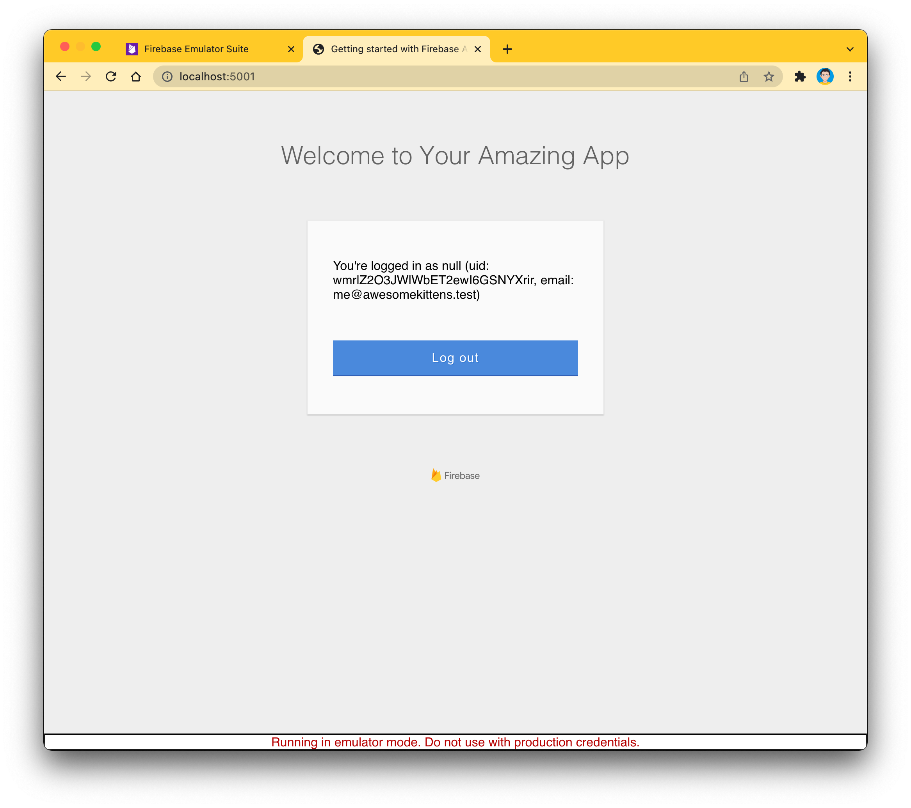
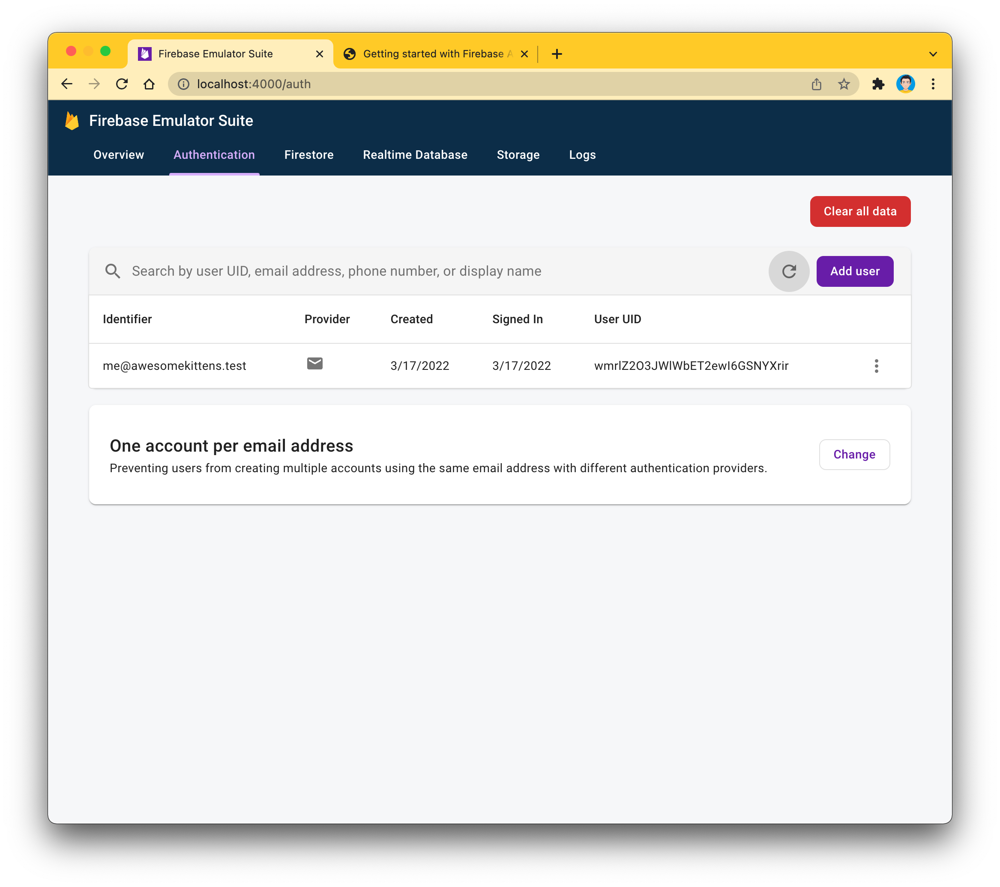

## Prerequisites

* Install the Firebase CLI tools and the Firebase Emulator suite ([instructions](https://firebase.google.com/docs/emulator-suite/install_and_configure))

## How to use

1. Clone the repository
    ```bash
    $ git clone https://github.com/stilwalli/firebase-auth.git
    $ cd firebase-auth
    ```

1. Install the dependencies
    ```bash
    $ npm install
    $ npm i firebase-tools -D
    ```

2. Init Firebase 
    ```
    $ npx firebase init hosting
    $ npx firebase init hosting
    $ npx firebase init hosting
    ```

    Few Screen Shots for Reference

    
    

3. Update index.js with your applications firebase config. The below snippet needs to be replaced with your firebase application details. This details can be found in project settings section of your firebase application in your google project

    ```
      const firebaseConfig = {
      apiKey: "dummy",
      authDomain: "dummy",
      projectId: "dummy",
      storageBucket: "dummy",
      messagingSenderId: "dummy",
      appId: "dummy",
      measurementId: "dummy"
      };
    ```

4. Replace dialog-flow-id & url in index.html file

     

3.  Run webpack to bundle your code:

    ```bash
    $ npx webpack
    ```

4.  Deploy to Firebase

    ```bash
    $ npx firebase deploy
    ```

6. Open `http://localhost:5001` in your browser
  
7. Sign up using an email address and password of your choice (e.g. `me@awesomekittens.test`)
8. You should now be signed in
  
9. Navigate to `http://localhost:4000/auth` to see the newly created user in the Firebase Authentication Emulator UI
  
10. Go back to the app, and sign out
11. Sign in using the credentials you used to create the test account# firebase-auth
