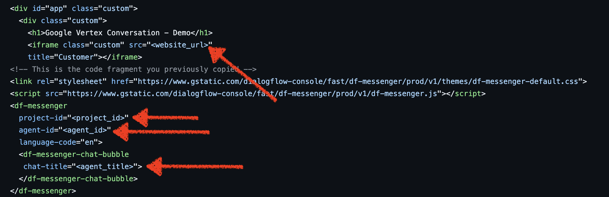

## Prerequisites

## How to use

1. Clone the repository
    ```bash
    $ git clone https://github.com/stilwalli/firebase-auth.git
    $ cd firebase-auth
    ```

1. Install the dependencies
    ```bash
    $ npm install
    $ npm i firebase-tools -D
    ```

2. Init Firebase hosting
    ```
    $ npx firebase logout
    $ npx firebase login --no-localhost
    $ npx firebase init hosting
    ```

    Few Screen Shots for Reference [Change public directory to dist]

    
    

3. Update index.js with your applications firebase config. The below snippet needs to be replaced with your firebase application details. This details can be found in project settings section of your firebase application in your google project

    ```
      const firebaseConfig = {
      apiKey: "dummy",
      authDomain: "dummy",
      projectId: "dummy",
      storageBucket: "dummy",
      messagingSenderId: "dummy",
      appId: "dummy",
      measurementId: "dummy"
      };
    ```

4. Replace dialog-flow-id & url in index.html file

     

5. [Optional] -> Do this to remove caching. When you run init hosting, it overwrite firebase.json. Resetting this to previously checked in code
    ```bash
    $ cp firebase.json.bkp firebase.json
    ```

6.  Run webpack to bundle your code:

    ```bash
    $ npx webpack
    ```

7.  Deploy to Firebase

    ```bash
    $ npx firebase deploy
    ```

8. Before you access the deployed url, add user in your firebase application 
  

9. Open the deployed firebase url with the user you just created.
  


10. At the botton of the page, click Logout


11. To Unhost from firebase
    ```bash
    $ npx firebase hosting:disable
    ```


